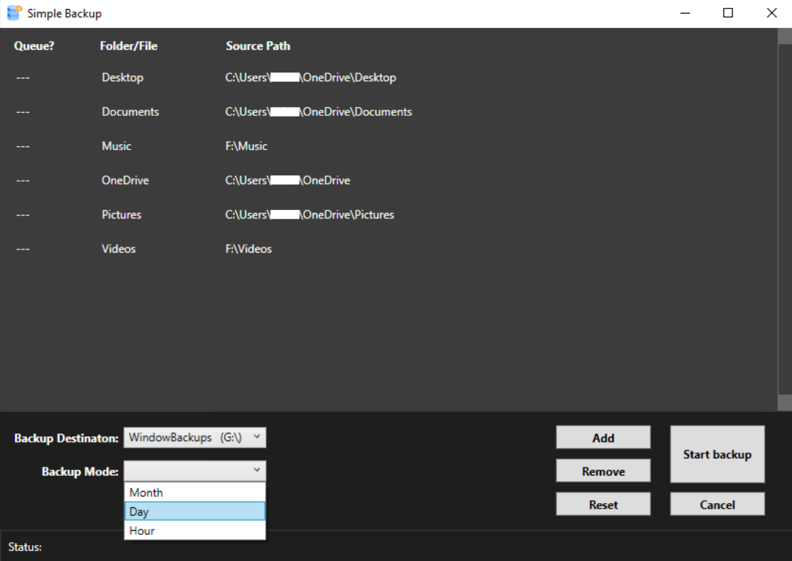

# Simple_Backup
A simple backup app for Window

Icons made by <a href="https://www.freepik.com" title="Freepik">Freepik</a> from <a href="https://www.flaticon.com/" title="Flaticon">www.flaticon.com</a>

# Description:
This is a self-contained (portable) app which would allow you to quickly make a copy of large number of files or a folders to a storage drive. It is made to be as simple as possible, which means the following:
* Starting a backup is effortless -- Just open the app and click start.
* There is no telemetry -- The app'sone and only job is to do backups.
* Managing to backed up data and the app itself is easy and intuitive(*) -- The backups can be accessed as normal files/folders (there will be no special tool needed, including the app itself)

(*) The backup files and folders will have the exact same name and folder structure, their content will not be accessed or modified in anyway. Furthermore, there is a single ".exe" file for the app and a log file named "Simple_Backup_Log", to save the user's latest setting configuration; to uninstall the app, just delete these two files. There will be not residual files, all backups will be left untouched and fully accessible like normal files/folders.

# Installation:
Just download the ".exe" in the lattest realease (shown on the right), and that is pretty much it. You can now click-on and use the app(**).
OPTIONAL: Move the app into a folder named "Simple Backup" on the intended backup drive. This will make everything placed neatly in a single folder.

(**) A caveat for the first boot: Window Defender will show a notification that the app is from a "Untrusted Publisher". This is because this app is not intended for any commercial distribution, thus it does not warranted the cost of a developer licence for Window (see the Footnotes for the developer comments).

# Usage guide:

# Footnotes:
There are some missing features that is currently being worked on:
1. Progress bar - the most tricky part is where to put it (aestheticly speaking).
2. Auto backup - Create a scheduled task, which can be change by the user.

Here are features that I though about, but still don't know if they are worth it (or simply have not figured out how to do yet):
1. Trusted Publisher Certificate - this would allow the app to not be seen as untrusted source source on first start. However, it is a paid feature for myself and I am not ready to commit to that yet.
2. Local installation (into the "./Program File" folder) - the app itself would required very little changes for this to happen. The problem is one again the "Trusted Publisher Certificate"
3. Encryption - encrypt the drive itself, so any system (different computer and OS) would need to put in a password to get the data from the drive. I just have not figured out how to do this yet.
4. Title bar theme and overall aesthetic - this will a lot of work just for better look. So this will be at the lowest priority.
