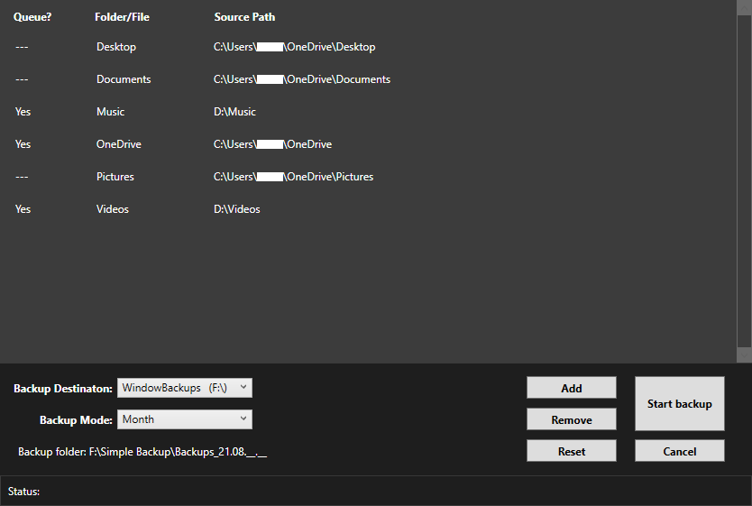
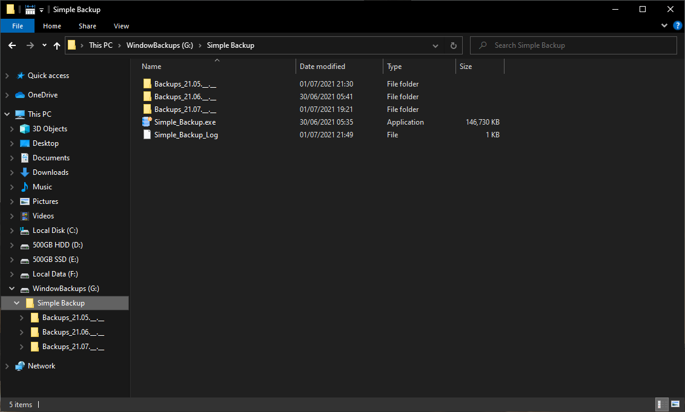

# Simple_Backup
A simple backup app for Window

Icons made by <a href="https://www.freepik.com" title="Freepik">Freepik</a> from <a href="https://www.flaticon.com/" title="Flaticon">www.flaticon.com</a>

# Description:
This is a self-contained (portable) app which would allow you to quickly make a copy of large number of files or folders to a storage drive. It is made to be as simple as possible, which means the following:
* Starting a backup is effortless -- Just open the app and click start.
* There is no telemetry -- The app's one and only job is to do backups.
* Managing backups and the app itself is easy and intuitive(*) -- The backups can be accessed as normal files/folders (there will be no special tool needed, including the app itself).

(*) The backup files and folders will have the exact same name and folder structure, their content will not be accessed or modified in anyway. Furthermore, there is a single ".exe" file for the app and a log file named "Simple_Backup_Log" (which will be generated after first boot), to save the user's latest setting configuration; to uninstall the app, just delete these two files. There will be not residual files, all backups will be left untouched and fully accessible as normal files/folders.

# Installation:
Just download the ".exe" in the lattest realease (shown on the right), and that is pretty much it. You can now click-on and use the app(**).

OPTIONAL: Move the app into a folder named "Simple Backup" on the intended backup drive. This will make everything placed neatly in a single folder.

(**) A caveat for the first boot: Window Defender will show a notification that the app is from a "Untrusted Publisher". This is because this app is not intended for any commercial distribution, thus it does not warranted the cost of a developer licence for Window (see the Footnotes for the developer comments).

# Usage guide:
The app will backup the files/folders that are queued, to the selected drive and according to the mode.

Backup selection types:
* Files -- will overwrite the old backup, until the selected time window has passed (Backup mode).
* Folder -- will backup up newly added files in the folder, until the selected time window has passed (Backup mode).

Modes:
* Month -- create and update the a backup for that month --- This is best for larger folders, with infrequent/unchanging files (such as photos, musics, etc.)
* Day -- create and update the a backup for that day --- This is for project folders, which contains files that you are currently working with.
* Hour -- create and update the a backup for that hour --- This is similar to the "Day" mode, but much more frequently.

# Footnotes:
There are some missing features that is currently being worked on:
1. Auto backup - Create a scheduled task, which can be change by the user.
2. Encryption - encrypt the drive itself, so any system (different computer and OS) would need to put in a password to get the data from the drive. I just have not figured out how to do this yet.

Here are features that I though about, but still don't know if they are worth it (or simply have not figured out how to do yet):
1. Trusted Publisher Certificate - this would allow the app to not be seen as from a untrusted publisher. However, it is a paid feature and I cannot commit to that yet.
2. Local installation (into the "./Program File" folder) - the app itself would required very little changes for this to happen. The problem is one again the "Trusted Publisher Certificate"
3. Title bar theme and overall aesthetic - this will a lot of work just for better look. So this will be at the lowest priority.
